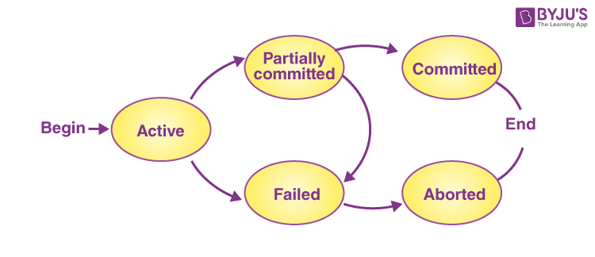
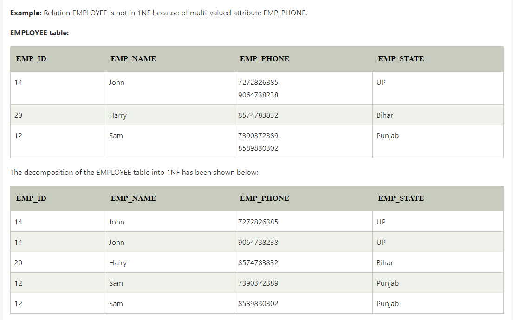
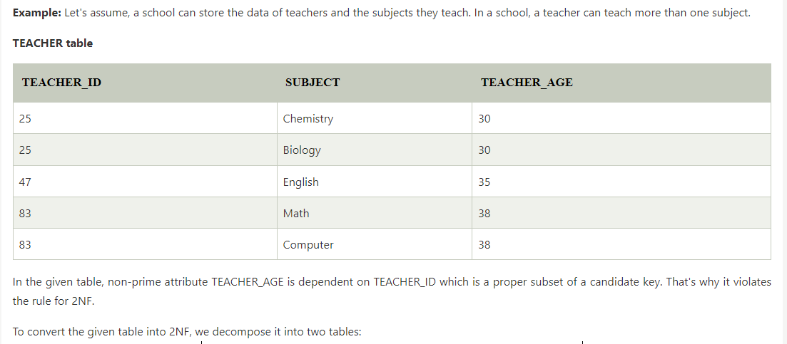
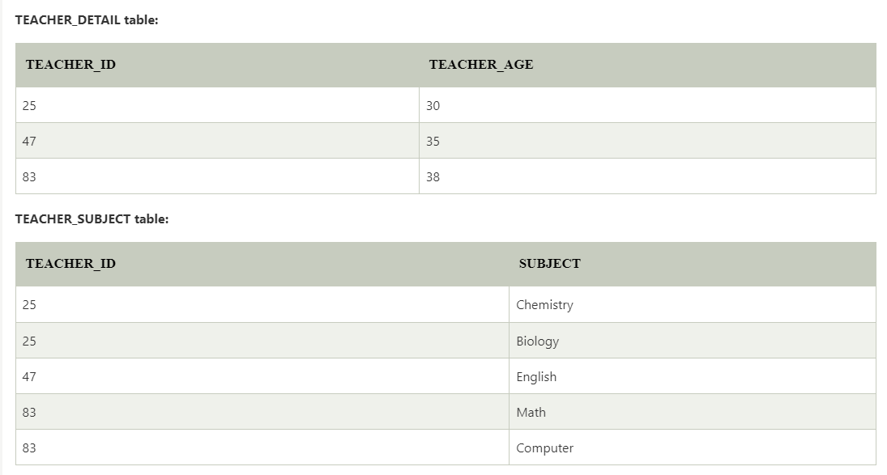

# SQL Interview Questions

## Transaction
-Transaction is a single logical unit of work formed by a set of operations. Transaction is a bundle of operations.

### Transaction State Image

### ACID Properties

-To ensure the consistency of the database ,Certain properties are followed by all .These properties are called as ACID properties of a transaction.

__ATOMICITY:__ Transaction occur completely or doesn't occur at all. That means no transaction occurs partially.

__CONSISTENCY:__ Database remains consistent before and after the transaction. __For Example__ Person 1 will send 100tk to Person 2 will have to receive 100tk.That is why after transaction will remain consistent.

__ISOLATION:__ Multiple transactions can occur simultaneously without causing any inconsistency.The transaction were executed serially one by one.

__DURABILITY:__ Its  After successful execution,Changes are written successfully to the permanent disk. Replication or something like that will be help to achieve durability.

### Normalization 
- Normalization is a process of making database consistent by :

 -Reducing the redundancies

 -Ensuring the integrity of data through lossless decomposition.
### First Normal Form (1NF)
 

### Second Normal Form (2NF)
- In the 2NF, relational must be in 1NF.
- In the second normal form, all non-key attributes are fully functional dependent on the primary key

